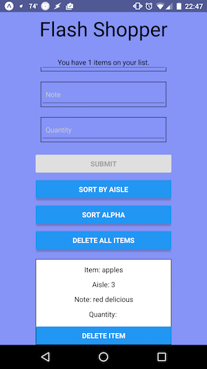

## Flash Shopper 2.0

### Flash Shopper: Get in, get out, and get on with your life.

This is a new port of my first Flash Shopper in React Native. It is rebuilt with [Create React Native App](https://github.com/react-community/create-react-native-app) because this makes it easier to build and deploy the app.

The user can add, sort, and delete items on the list. There is also a Pantry section where the user can add and save commonly bought items to easily add to the active list.

Tested on:

* Android (real Nexus 5X and Nexus 9) using [Expo app](https://expo.io/)
* iPhone (iPhone 6 simulator) using [Expo app](https://expo.io/)

Sources that proved useful in building the app:

[Beginner's Guide to React Native and Firebase](https://firebase.googleblog.com/2016/01/the-beginners-guide-to-react-native-and_84.html)

[Getting Started with React Native and Firebase](https://medium.com/@jamesmarino/getting-started-with-react-native-and-firebase-ab1f396db549)
